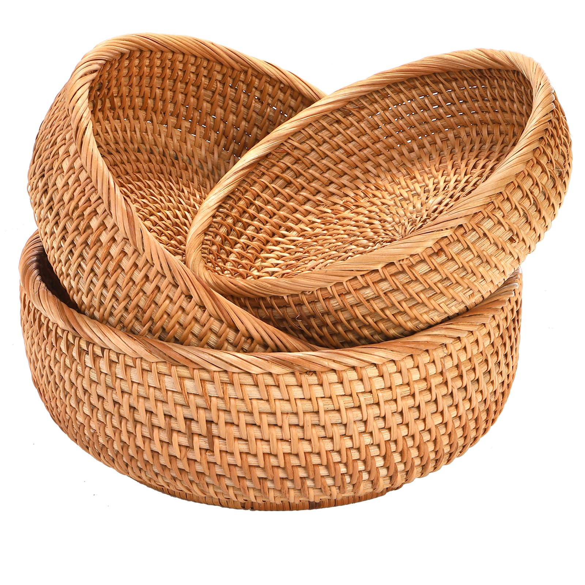
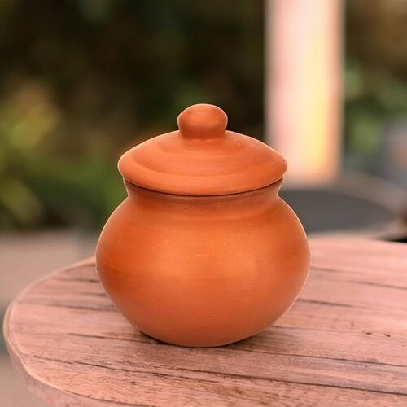
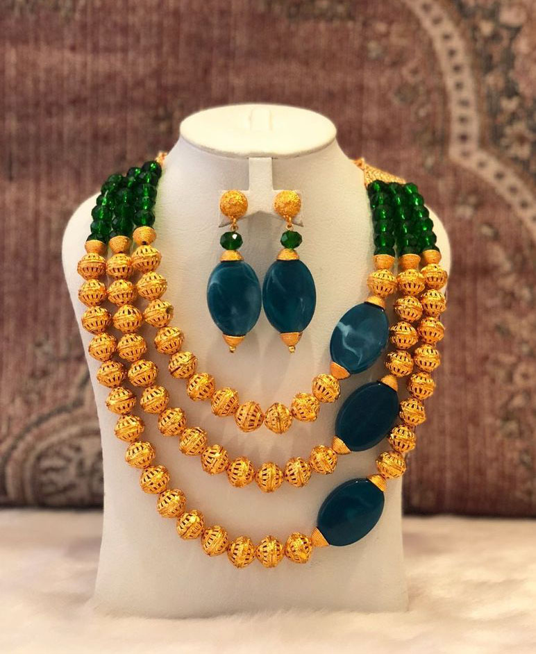

<!DOCTYPE html>
<html lang="en">
<head>
  <meta charset="UTF-8" />
  <meta name="viewport" content="width=device-width, initial-scale=1.0"/>
  <title>Interactive BioBloom</title>
  
  
</head>
<body class="bg-pink-50 text-gray-800">

  <!-- Header -->
  <header class="bg-white shadow p-6 text-center">
    <h1 class="text-3xl font-bold text-pink-700">BioBloom🌸</h1>
    
Beautifully made with love and creativity

  </header>

  <!-- Gallery Section -->
  <main class="p-8 grid gap-6 grid-cols-1 sm:grid-cols-2 md:grid-cols-3 lg:grid-cols-4">
    <!-- Item -->
    

      
      <h2 class="font-semibold text-lg">Woven Basket</h2>
      
Handcrafted with natural fibers.

      <button class="mt-2 bg-pink-600 text-white px-3 py-1 rounded hover:bg-pink-700">Buy Now</button>
    

    <!-- Item 2 -->
    

      
      <h2 class="font-semibold text-lg">Clay Pot</h2>
      
Earthy tones with a rustic finish.

      <button class="mt-2 bg-pink-600 text-white px-3 py-1 rounded hover:bg-pink-700">Buy Now</button>
    

    <!-- Item 3 -->
    

      
      <h2 class="font-semibold text-lg">Beaded Jewelry</h2>
      
Colorful and unique accessories.

      <button class="mt-2 bg-pink-600 text-white px-3 py-1 rounded hover:bg-pink-700">Buy Now</button>
    

  </main>

  <!-- Image Modal -->
  

    

      <button onclick="closeModal()" class="absolute top-2 right-2 text-gray-500 hover:text-red-500 text-xl">&times;</button>
      
      <h2 id="modalTitle" class="text-xl font-semibold mb-2"></h2>
      <button class="bg-pink-600 text-white px-4 py-2 rounded hover:bg-pink-700">Buy Now</button>
    

  

  <!-- Footer -->
  <footer class="bg-white text-center p-4 mt-10 text-sm text-gray-500">
    © 2025 BioBloom. All rights reserved.
  </footer>

  <!-- JS Script -->
  

</body>
</html>
